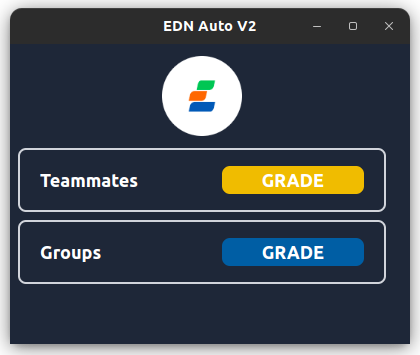
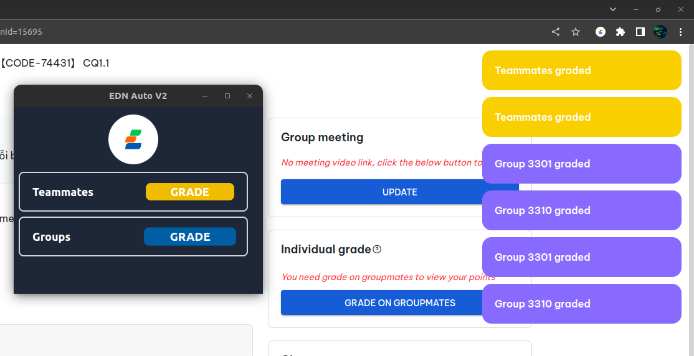

# EDN Auto V2

This is an Browser Extension for Automate boring grading stars for users on EDN platform.

## How to use ?

First, go to the [release page](./releases). Then download the newest version you can find, it comes as a ZIP file. Save it and extract it.

Go to your browser, make sure to enable Developer Mode, then choose `Load Unpacked`. Browse to the folder you just extracted the extension and choose it.

One the extension is loaded, this is the UI you will get.

Just click `GRADE` and you will be good to go!

Once the grading process is completed, you will see the notification on the top right side of your browser.

Enjoy!
